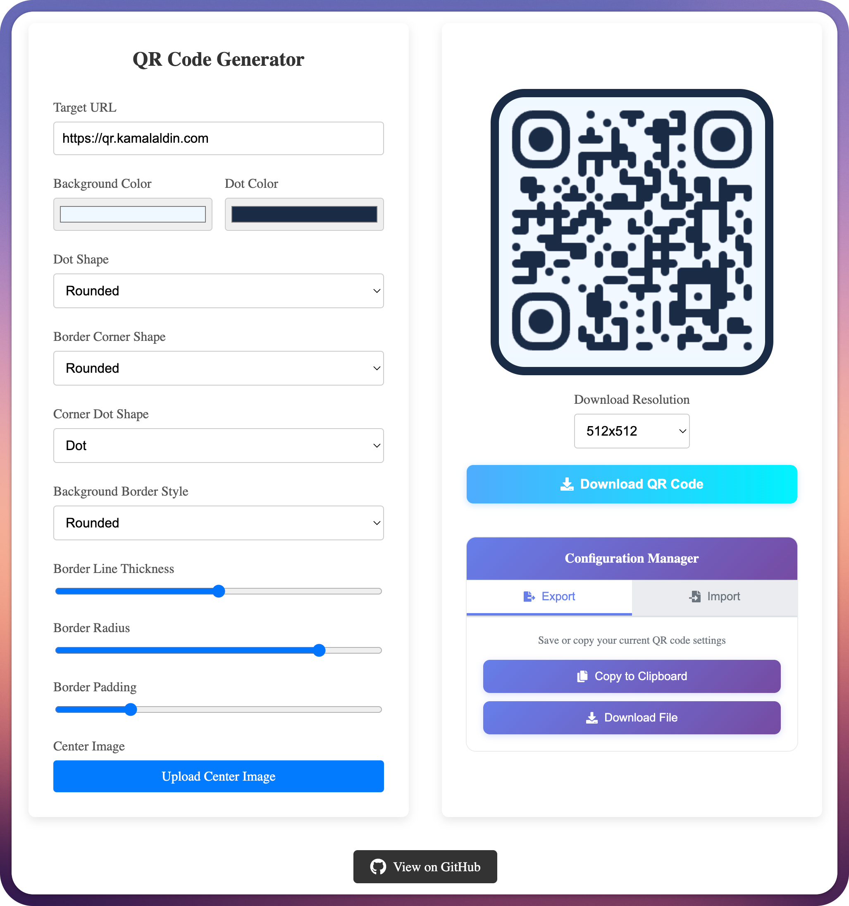

# QR Code Generator

A modern, feature-rich QR code generator built with React and TypeScript. Create beautiful, customizable QR codes with live preview, save and restore configurations, and download in multiple resolutions.



## Features

- **Live Preview** - Real-time QR code generation as you customize
- **Full Customization**
  - Custom colors for background and dots
  - Multiple dot shapes (square, circle, rounded)
  - Customizable corner styles
  - Adjustable margins and borders
  - Border radius control for rounded backgrounds
  - Center logo/image support
- **Configuration Management**
  - Export configurations as JSON
  - Import configurations from file or clipboard
  - Drag & drop configuration files
  - Save and share QR code designs
- **High-Resolution Export** - Download QR codes in 512x512, 1024x1024, or 2048x2048 resolution
- **Responsive Design** - Works seamlessly on desktop and mobile devices

## Tech Stack

- **React 18** - UI framework
- **TypeScript** - Type safety
- **qr-code-styling** - QR code generation library
- **html2canvas** - Canvas manipulation
- **React Icons** - Icon library
- **Docker** - Containerization support
- **GitHub Actions** - CI/CD pipeline

## Getting Started

### Prerequisites

- Node.js 16+ and npm
- (Optional) Docker for containerized deployment

### Installation

1. Clone the repository:
```bash
git clone https://github.com/kamal94/qr-code-generator.git
cd qr-code-generator
```

2. Install dependencies:
```bash
npm install
```

3. Start the development server:
```bash
npm start
```

4. Open [http://localhost:3000](http://localhost:3000) in your browser

## Available Scripts

### `npm start`
Runs the app in development mode at [http://localhost:3000](http://localhost:3000)

### `npm test`
Launches the test runner in interactive watch mode

### `npm run build`
Builds the production-ready app to the `build` folder

## Docker Deployment

### Using Make (Recommended)

The project includes a Makefile for easy Docker operations:

```bash
# Build the Docker image
make build

# Run the container (available at http://localhost:8080)
make run

# View logs
make logs

# Open in browser (macOS)
make open

# Stop the container
make stop

# Clean up images and containers
make clean

# Rebuild from scratch
make rebuild
```

### Manual Docker Commands

```bash
# Build the image
docker build -t qr-code-generator:local .

# Run the container
docker run -d --name qr-code-generator -p 8080:80 qr-code-generator:local

# Stop and remove
docker rm -f qr-code-generator
```

## Usage

### Creating a QR Code

1. Enter your target URL in the "Target URL" field
2. Customize appearance:
   - Choose background and dot colors
   - Select dot shapes and corner styles
   - Adjust margins, borders, and border radius
   - Upload a center image/logo (optional)
3. Preview updates in real-time
4. Select desired download resolution
5. Click "Download QR Code" to save

### Configuration Management

#### Export Configuration
1. Click the "Export" tab in Configuration Manager
2. Choose to either:
   - Copy to clipboard for quick sharing
   - Download as JSON file for later use

#### Import Configuration
1. Click the "Import" tab in Configuration Manager
2. Either:
   - Drag & drop a JSON configuration file
   - Click to browse and select a file
   - Paste JSON directly into the text area
3. Configuration applies immediately

### Example Configuration

```json
{
  "url": "https://example.com",
  "bgColor": "#f0f8ff",
  "dotColor": "#1a2a45",
  "dotStyle": "rounded",
  "cornerSquareStyle": "extra-rounded",
  "cornerDotStyle": "dot",
  "centerImage": null,
  "qrMargin": 20,
  "downloadSize": 1024,
  "backgroundBorderStyle": "rounded",
  "borderRadius": 20,
  "borderWidth": 0
}
```

## Deployment

### GitHub Pages

The project includes a GitHub Actions workflow that automatically deploys to GitHub Pages on every push to the `master` branch.

To enable:
1. Push your code to GitHub
2. Enable GitHub Pages in repository settings
3. Set source to `gh-pages` branch
4. The site will be available at `https://[username].github.io/qr-code-generator/`

### Other platforms

The built application is a static React app and can be deployed to:
- Vercel
- Netlify
- AWS S3 + CloudFront
- Azure Static Web Apps
- Any static hosting service

Simply run `npm run build` and deploy the `build` folder.

## Testing

Run the test suite:
```bash
npm test
```

The project includes:
- Component tests for the main App
- Canvas manipulation tests for QR code generation
- Configuration import/export tests

## Contributing

Contributions are welcome! Please feel free to submit a Pull Request.

## License

This project is open source and available under the MIT License.

## Links

- **Live Demo**: [GitHub Pages](https://kamal94.github.io/qr-code-generator/)
- **Repository**: [GitHub](https://github.com/kamal94/qr-code-generator)

## Acknowledgments

- Built with [qr-code-styling](https://github.com/kozakdenys/qr-code-styling)
- Icons from [react-icons](https://react-icons.github.io/react-icons/)
- Bootstrapped with [Create React App](https://create-react-app.dev/)
